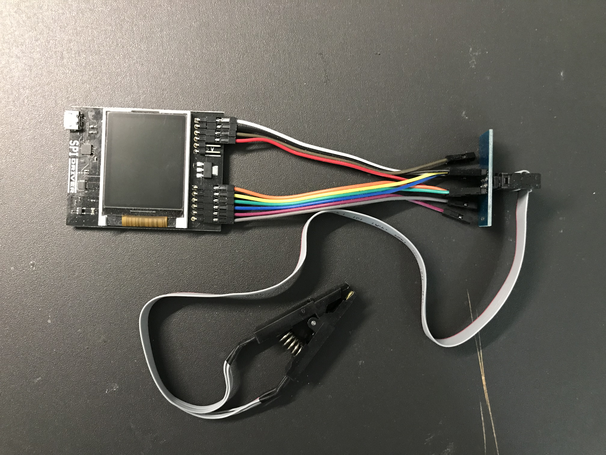
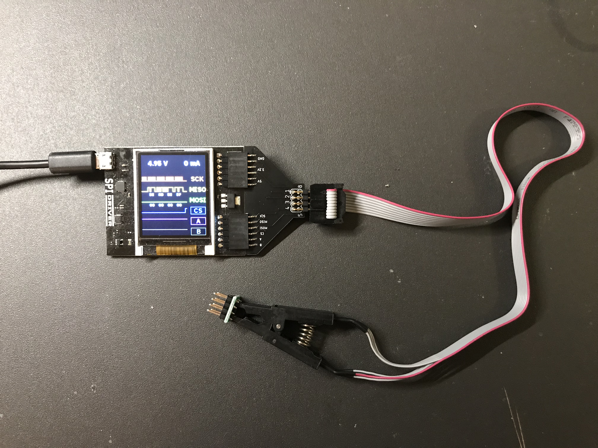
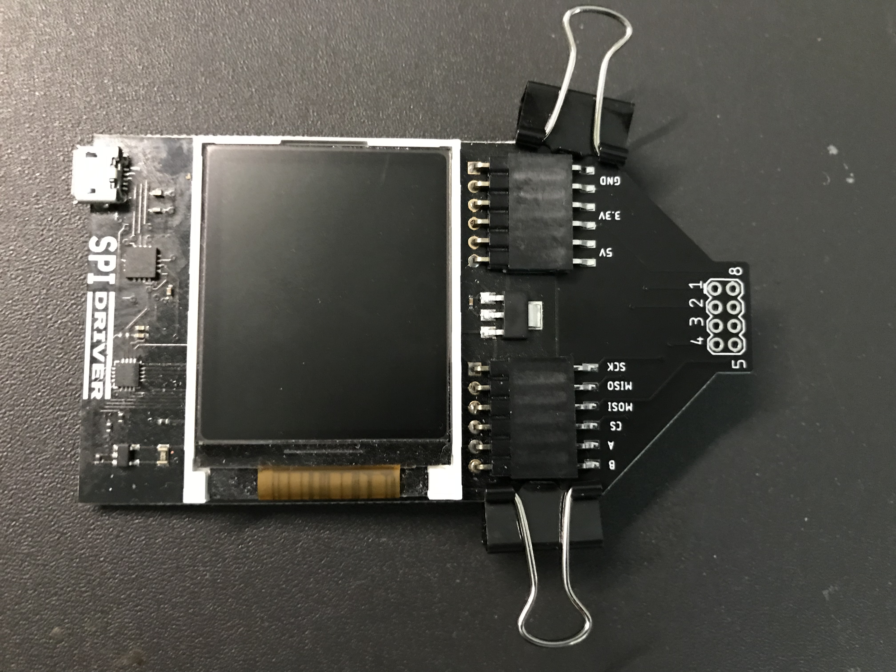
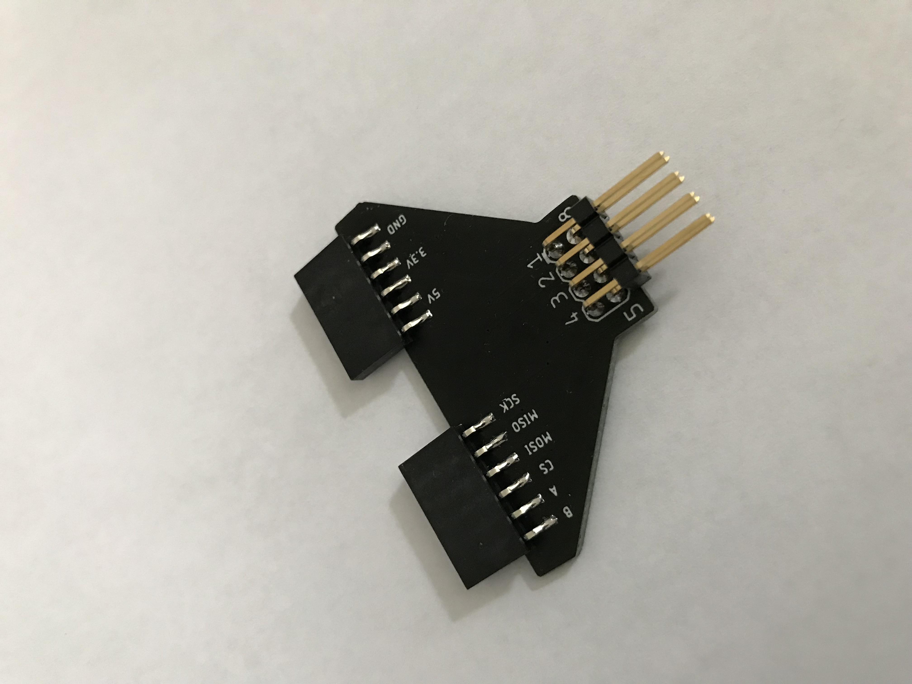

# SPIDriver SOIC Adapter board

While most of my boards are basically electrical things with some mechanical aspects,
some of them are primarily mechnical things with some electrical aspects. This board
is one of those.

I have an ExCamera Labs SPIDriver ( https://www.crowdsupply.com/excamera/spidriver ), and
I've been using it to read/write to various types of SPI memory chips; the hookup wires
provided with the unit are certainly multipupose, but they aren't optimized for connection
the SPIDriver to the SOIC in-circuit chip clip.

Before:

After:

Assembly is simple:
1. First attach the two Harwin M20-7910642R header sockets on the SPIDriver's headers.
(Link to part: https://www.mouser.ca/ProductDetail/Harwin/M20-7910642R?qs=%2Fha2pyFaduh6CW27Bf4Ji3liOHxzgSHZx%252BrczPoIZ0OamkTSPd60Zw%3D%3D )

2. Position the PC board right up agains the SPIDriver board, and attach clips to hold
it in place while soldering takes place.

3. Add the 2-row headers and solder them in place.

I designed the board using the free version of EAGLE (2-layer, less than 100mm on both
X- and Y-axes).  The gerbers are included in this repository, in case you want to get your
own set made.

